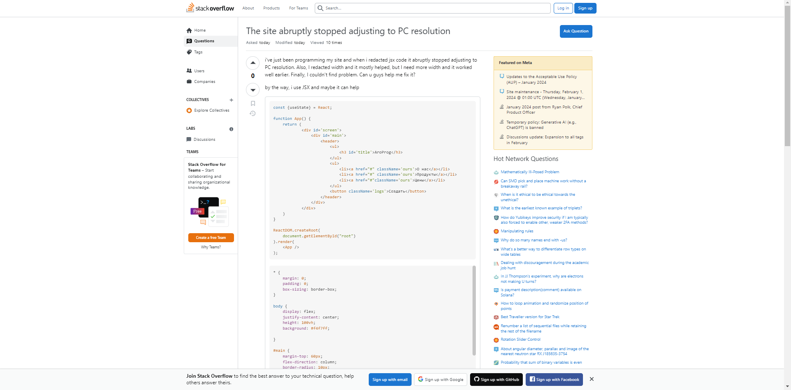

  

<h1>Introduction</h1>

In the space of software engineering, effective communication is important, and asking questions the "smart way" is a skill that can significantly impact an individual's success in problem-solving and collaboration within a community, workspace, or any other environment. This essay will explore the significance of asking smart questions and analyze examples from StackOverflow to understand the positive outcomes of effective communication and the negative consequences when the principles of effective communication are ignored.

<h1>The Smart Way: Efficient and Effective Help</h1>

  

<h2>Smart Question Example</h2>

We are going to be examining a smart question on StackOverflow that aligns with the principles of effective communication within the open source community. The question is titled "What's the best way to represent a list of big numpy arrays with pandas? <a href="https://stackoverflow.com/questions/77888018/whats-the-best-way-to-represent-a-list-of-big-numpy-arrays-with-pandas" rel="noopener noreferrer" target="_blank">Smart Question Example</a>. This question demonstrates several characteristics of a smart question.

This question adheres to several characteristics such as research effort. The developer provides information about their attempt to solve the problem, providing a clear context of the problem the developer is working on. It explains that they are dealing with a substantial model that processes parameters and generates outputs. The developer not only asks for guidance but also contributes to the discussion by presenting two potential solutions that they have considered. By providing their thoughts, it shows that they have invested in the problem, reinforcing their commitment to finding a solution.

<h1>The Not-So-Smart Way: Inefficient Help and Frustration</h1>

  

<h2>Not-So-Smart Question Example</h2>

Contrastingly, let's analyze a question titled "The site abruptly stopped adjusting to PC resolution" <a href="https://stackoverflow.com/questions/77887965/the-site-abruptly-stopped-adjusting-to-pc-resolution" rel="noopener noreferrer" target="_blank">Not-So-Smart Example</a>. This question deviates from the effective communication principles, leading to less effective help from the community.

This question exhibits several characteristics that make it less ideal. The question is vague and lacks specific details about the problem. Phrases like "it abruptly stopped adjusting to PC resolution," "I redacted width and it mostly helped," and "I need more width and it worked well earlier" are unclear and do not provide enough information for someone to diagnose the issue. The user also mentions encountering a problem but doesn't provide any error messages, console logs, or specific symptoms. This would make it challenging for potential answerers from the community to understand the nature of the issue and provide targeted assistance. To improve the question, the user should provide a more detailed description of the issue, share relevant error messages or console logs, and clearly articulate the desired outcome or specific assistance that they are seeking. Additionally, presenting the code snippets in a more organized and readable manner can enhance the chances of getting a helpful response from the comunity.

<h1>Insights and Reflections</h1>

Analyzing these contrasting examples sheds light on the critical importance of asking smart questions in the software engineering community. Smart questions not only lead to more effective and efficient answers but also create a positive and collaborative environment.

As a student studying computer science, the experience of evaluating these questions reinforced the significance of thorough research and clear communication. The evaluation highlighted the community's willingness to help when presented with well-formulated questions and the frustration that comes when faced with poorly articulated questions.

<h1>Conclusion</h1>

In conclusion, asking smart questions is not just a formality but a huge aspect of effective communication within the open source community. The examples from StackOverflow illustrate how following the guidelines to effective communication leads to positive outcomes, while deviating from these principles can result in less helpful or even no interactions.

This exercise serves as a valuable lesson, emphasizing the need to develop the skill of asking smart questions. By doing so, individuals, like myself, can contribute to a more collaborative and supportive community, ultimately enhancing the overall experience of sharing knowledge and problem-solving in the field of software engineering.