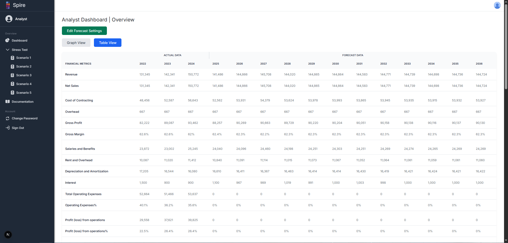

  

<h1>Introduction</h1>

ICS 414 provided a comprehensive experience in full-stack software development while emphasizing professional collaboration and communication practices. Through the TeamUSA2025 project, our group translated a spreadsheet-based fiscal sustainability model into a user-friendly web application. The project incorporated modern technologies including Next.js, TypeScript, React, and PostgreSQL. More importantly, the course highlighted the importance of aligning technical implementation with user needs and project objectives. This reflection summarizes the experience, focusing on collaboration, milestone-based development, and communication with both technical and non-technical stakeholders.

<h1>Collaboration Beyond the Code</h1>

Working within a team of eight required effective coordination and mutual accountability. Early in the semester, we developed a team contract to establish clear expectations regarding responsibilities, communication methods, and work schedules. Regular meetings and updates on GitHub ensured transparency in task distribution and progress tracking. Code reviews and pair programming sessions promoted knowledge sharing and consistency in our codebase. Through this experience, I gained a deeper appreciation for version control systems, issue tracking, and structured workflows as essential components of team-based software development.

<h1>Milestones as Client-Oriented Development</h1>

The course’s milestone structure simulated interactions between developers and clients. Each milestone—whether focused on user interface mockups, data model design, or feature implementation—required us to articulate our decisions clearly and align them with project requirements. During Milestone 1, for instance, mockups prompted us to think carefully about usability and user roles. Milestone 2 involved translating financial logic into a normalized database schema. Throughout these phases, we learned to communicate our ideas in a manner accessible to non-technical users, particularly those representing roles such as auditors, analysts, or executives. This practice helped bridge the gap between technical development and practical application.

<h1>Technical and Process-Oriented Learning</h1>

Beyond implementation, ICS 414 emphasized development practices common in professional environments. Tools such as ESLint, GitHub Actions, and TestCafe supported code quality, continuous integration, and end-to-end testing. These tools encouraged consistency and reduced the likelihood of regression errors during deployment. In addition to gaining technical proficiency, I also developed the ability to scope features, assess trade-offs, and manage incomplete or evolving requirements. The course highlighted that effective software engineering involves not only writing functional code but also coordinating development processes and maintaining long-term project stability.

<h1>Conclusion</h1>

Overall, ICS 414 provided a valuable opportunity to apply software engineering principles in a collaborative, project-based setting. The course reinforced the importance of team coordination, clear communication, and user-focused development. While the project enhanced my technical skills in full-stack web development, it also improved my ability to collaborate, document work, and present technical concepts to varied audiences. These experiences reflect the realities of professional software development and will inform how I approach future roles within the field.
