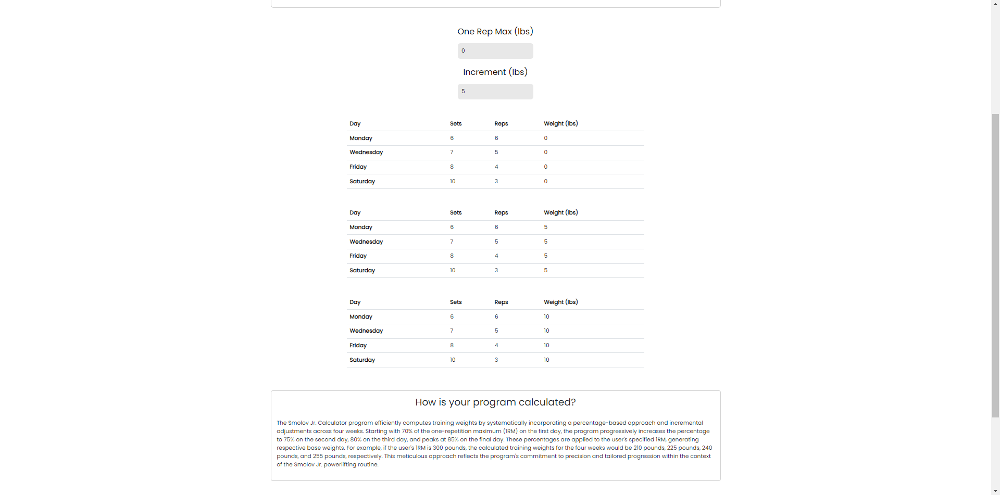

<div class="text-center p-4">
  
</div>


I developed the weightlifting calculator as a web application as part of a personal project, with the primary goal of healing me with my health and fitness.

My website is equipped with two different calculaotrs. The Smolov Jr calculator is designed to assist users in implementing the renowned Smolov Jr program, optimizing their training for increased strength. Additionally, the one-rep max calculator, utilizing the Brzycki formula, offers a reliable method to estimate your maximum lifting capacity.

This weightlifting calculator is a frontend application that utilizes React.js framework for its hooks and reusable components, enabling it to efficiently manage stateful logic. This application also uses Bootstrap 5 for its intuitive grid system and responsive design features to create a sleep and visually appealing user interface.

All of the calculations for my weightlifting website were made using JavaScript, ensuring seamless execution within the browser environment, allowing users to conveniently perform dynamic calculations.

Here is some code that illustrates how my application performs its calculations:

<!-- ```cpp
const [maxLift, setMaxLift] = useState(0)
const [increment, setIncrement] = useState(5)

const maxChange = (e) =>{ setMaxLift(e.target.value) }

const incrementChange = (e) =>{ setIncrement(e.target.value) }

const customRound = (value, step) => { return 2.5 * Math.floor((Math.floor(value) + step / 2) / step); };

const calculateWeight = (percentage) => {
  const roundedWeight = customRound(maxLift * percentage, 2.5);
  return roundedWeight;
}
``` -->