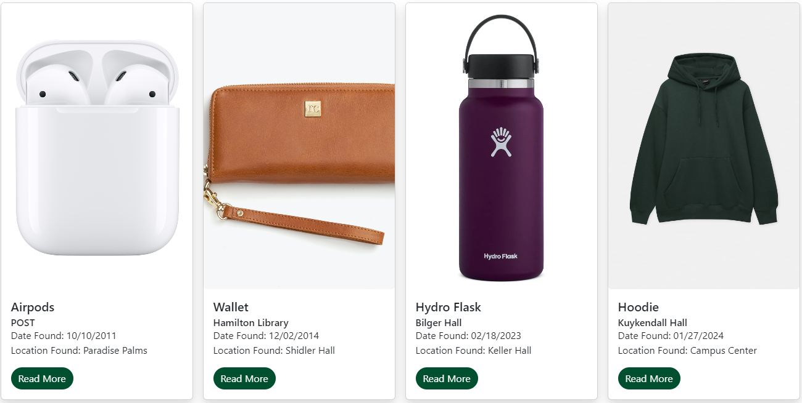

<div class="text-center p-4">
  
</div>

We developed the Lost and Found website as a platform to serve as a centralized catalog for lost items within our university community, allowing departments to post lost items for students or anyone to find. The primary goal of this project was to facilitate the retrieval process for lost belongings and enhance the overall experience of reuniting lost items with their rightful owners.

The website is equipped with intuitive features for both posting lost items and searching for lost belongings. Users can easily navigate through the catalog to locate items they've lost or browse through recent postings from various departments. Additionally, the platform ensures seamless communication between those who have lost items and those who have found them, fostering a collaborative environment to facilitate the return of lost belongings.

The Lost and Found website features departmental accounts for different university departments to post found items, each managed by designated staff members. These accounts have specific permissions for adding, editing, and removing listings. Additionally, there is an admin account overseeing all departmental accounts, ensuring compliance with site policies and resolving disputes when necessary. This streamlined structure facilitates efficient coordination between departments while maintaining accountability and reliability.

This Lost and Found website is a frontend application developed using the React.js framework, leveraging its stateful logic and reusable components to provide an efficient and user-friendly experience. Bootstrap 5 was utilized for its responsive design features, ensuring accessibility across different devices and screen sizes. All functionalities, including item posting and eediting, were implemented using Meteor.js, enabling dynamic interactions within the browser environment.

Here is an example of how the information is displayed using a React Bootstrap card component:

```
    <Card className="h-100 shadow">
      <Card.Img className="object-image" src={lostObject.image} alt={lostObject.name} />
      <Card.Body>
        <Card.Title>{lostObject.name}</Card.Title>
        <Card.Subtitle>{lostObject.currentDepartment}</Card.Subtitle>
        <Card.Text>
          Date Found: {lostObject.dateFound}
          <br />
          Location Found: {lostObject.locationFound}
        </Card.Text>
        <Button
          variant="primary"
          onClick={handleShow}
          style={{ backgroundColor: '#00502f', borderRadius: 60, border: 'none' }}
        >
          Read More
        </Button>

        <Modal
          show={showModal}
          onHide={handleClose}
          centered
          scrollable
          className="text-black"
        >
          <Modal.Header closeButton style={{ borderColor: '#282828', backgroundColor: '#282828' }}>
            <Modal.Title>
              <h6 style={{ color: 'd3d3d3' }}>{lostObject.name}</h6>
            </Modal.Title>
          </Modal.Header>
          <Modal.Body>
            <CampusMap />
            Example Text
          </Modal.Body>
        </Modal>

      </Card.Body>
    </Card>
  }
```

<div class="text-center p-4">
  
</div>

In conclusion, the Lost and Found website helps people at our university find their lost items easily. It's user-friendly, with features for posting and searching for lost items. Departments can manage their own accounts to post found items, ensuring efficient coordination. Built with React.js, Bootstrap 5, and Meteor.js, it provides a seamless experience for users.

You can find more information on the project here:

Github IO: <a href=" https://uhm-lost-and-found.github.io/"> https://uhm-lost-and-found.github.io/</a>
Github Repository: <a href="https://uhm-lost-and-found.github.io/">https://uhm-lost-and-found.github.io/</a>
Deployed Site: <a href="https://uhmlostandfound.com/">https://uhmlostandfound.com/</a>