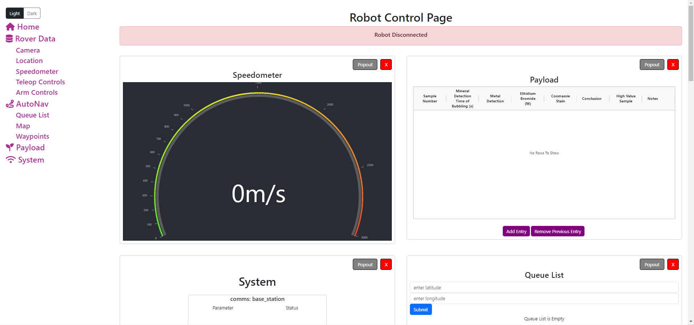

  

The Robotics and Space Explorations team, a vertically integrated project (VIP) at the University of Hawai'i at Manoa, is dedicated to designing and building a rover for participation in the University Rover Challenge (URC). Specifically, I am a member of the Ground Station software sub-team, responsible for designing and developing a functional user interface.

To enhance user experience and efficiency, our sub-team has successfully restructured the rover’s control user interface. Our tasks are closely aligned with the progress of other sub-teams within ROSE, and our efforts contribute to the overall success of the project.

This website is built using React, leveraging its hooks and dependencies. This implementation allows for efficient management of stateful logic and enables us to extend React's capabilities. Additionally, it contributes to improved code organization and enhances the overall development experience by providing solutions to common challenges encountered in building modern web applications.

Express.js serves as a crucial component in our system, facilitating communication with the rover to acquire essential data such as linear speed while also enabling us to control the robot. Leveraging Express.js for our server-side implementation ensures a robust and efficient communication channel. By establishing routes and handling requests, we seamlessly retrieve real-time information, allowing us to monitor the rover's linear speed dynamically. Moreover, Express.js empowers us to implement controls that influence the robot's behavior, providing a responsive and interactive means of managing the rover's actions. This integration not only enhances the reliability of data retrieval but also offers a streamlined approach to remotely controlling and monitoring the rover's performance in the field.